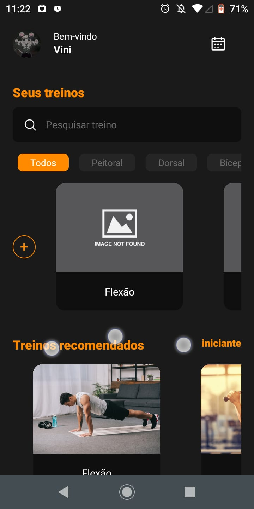
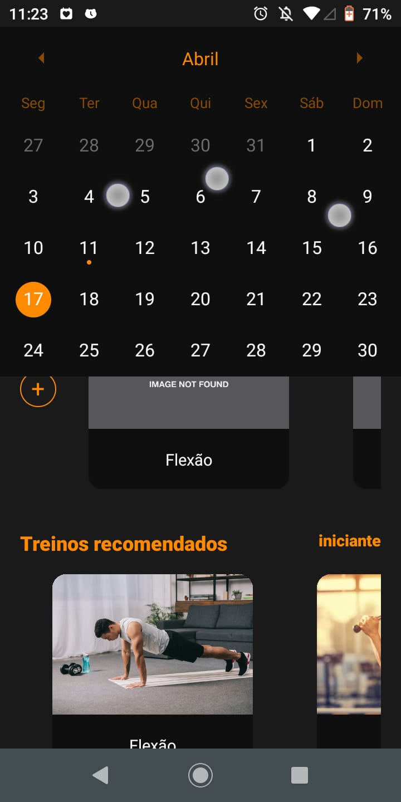
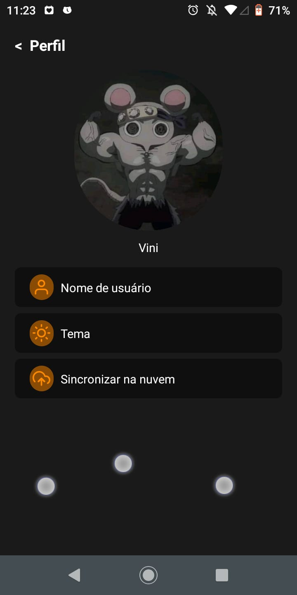
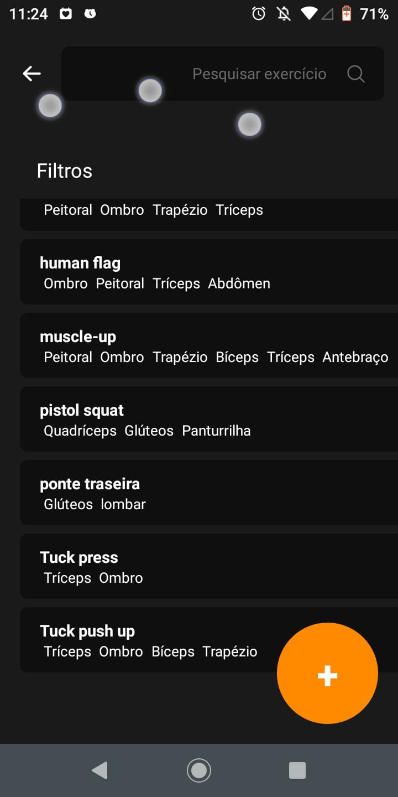
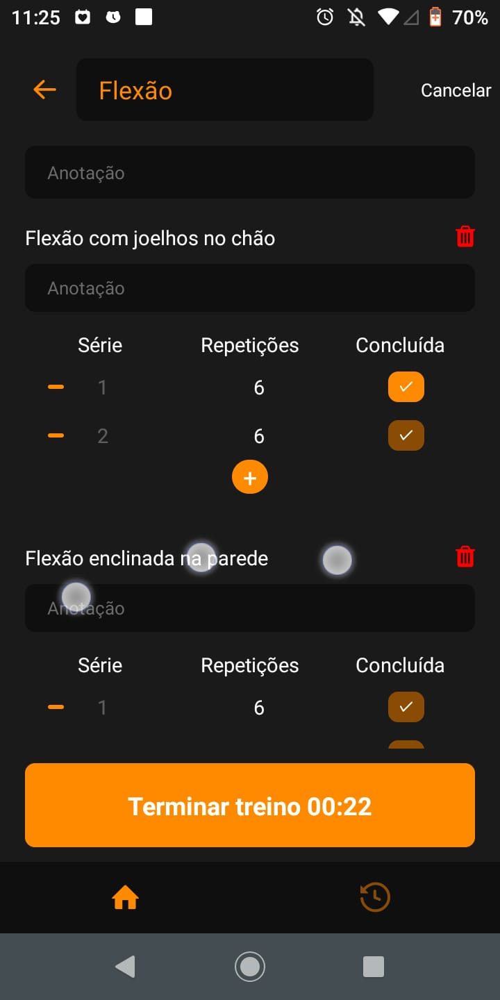
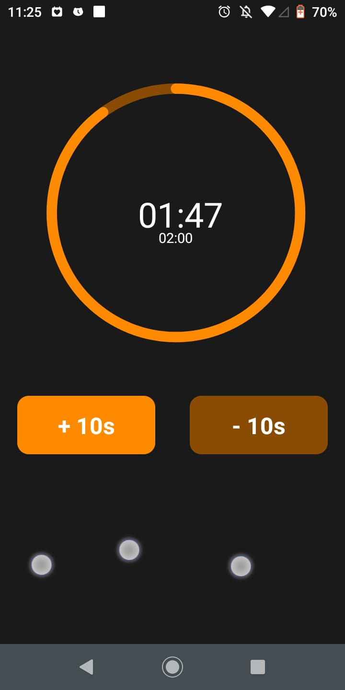
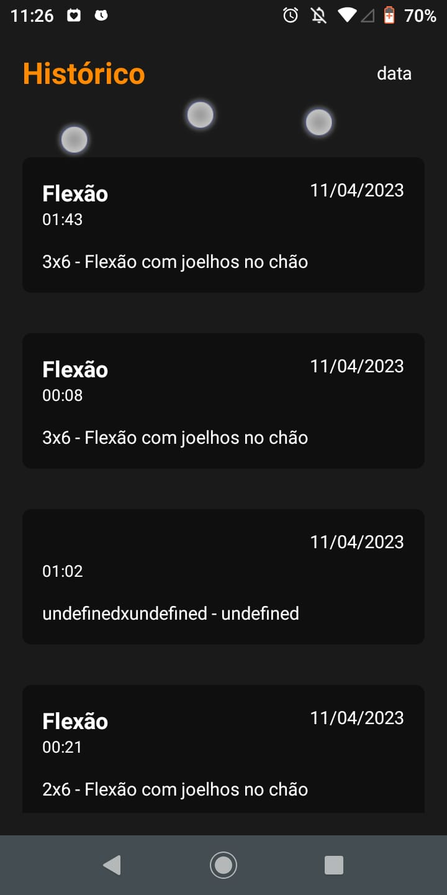

## BL Calistenia
Este aplicativo permite que você crie e analise seus próprios treinos ao longo do tempo, adicione exercícios específicos, acompanhe sua frequência de treino em um calendário e visualize todo o seu histórico de treinos. Uma funcionalidade futura incluirá gráficos para acompanhar seu desempenho.

## Tecnologias
>
Aqui está as tecnologias usadas no projeto

  - @react-navigation/material-top-tabs: ^6.5.2,
  - @react-navigation/native: ^6.1.2,
  - @react-navigation/native-stack: ^6.9.8,
  - @react-navigation/stack: ^6.3.11,
  - @reduxjs/toolkit: ^1.9.3,
  - @shopify/flash-list: ^1.4.2,
  - react-native: 0.71.3,
  - react-native-background-actions: ^3.0.0,
  - react-native-calendars: ^1.1293.0,
  - react-native-fast-image: ^8.6.3,
  - react-native-gesture-handler: ^2.9.0,
  - react-native-image-picker: ^5.0.1,
  - react-native-reanimated: ^2.14.4,
  - react-redux: ^8.0.5,
  - realm: ^11.3.2,
  - styled-components: ^5.3.6,
 
 ## Serviços usados
  - Github

## Prints
  
  
  
  
  
  
  
  
  
  

## Funcionalidades

As principais funcionalidades são:
 - Criar/Atualizar/Deletar seus treinos
 - Criar seus exercícios
 - Visualizar um calendário com seus dias de treinos
 - Visualizar seu histórico de treino
 - Marcar suas séries e repetições durante sua sessão de treino
 - Analisar seu desempenho através de gráficos (FUTURA)
 - Backup em nuvem (FUTURA)

## Links
 - LinkedIn:  www.linkedin.com/in/vinicius-b-leite
 - Repositório: https://github.com/Vinicius-B-Leite/blcalistenia
 - Em casos de bugs, por favor me contate
  viniciusbleite21@gmail.com

## Versão
 1.0.0

## Autor
Feito com <3 por Vinicius B. Leite